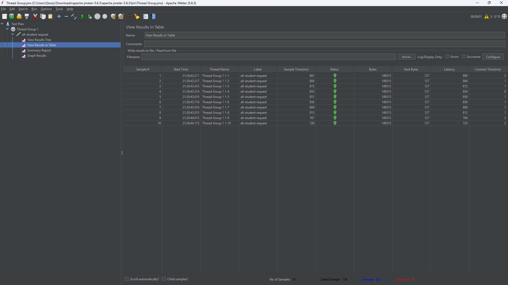
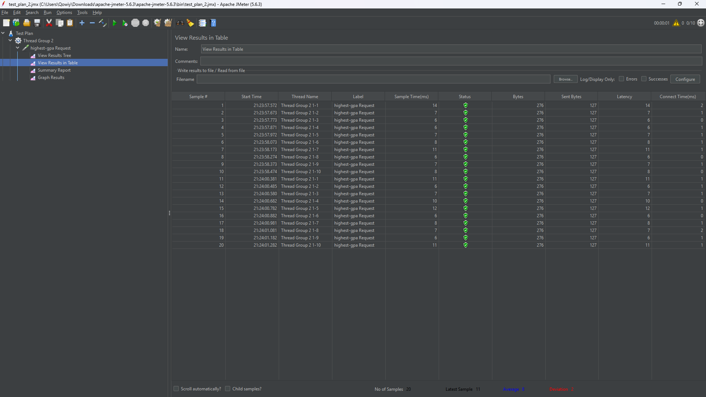
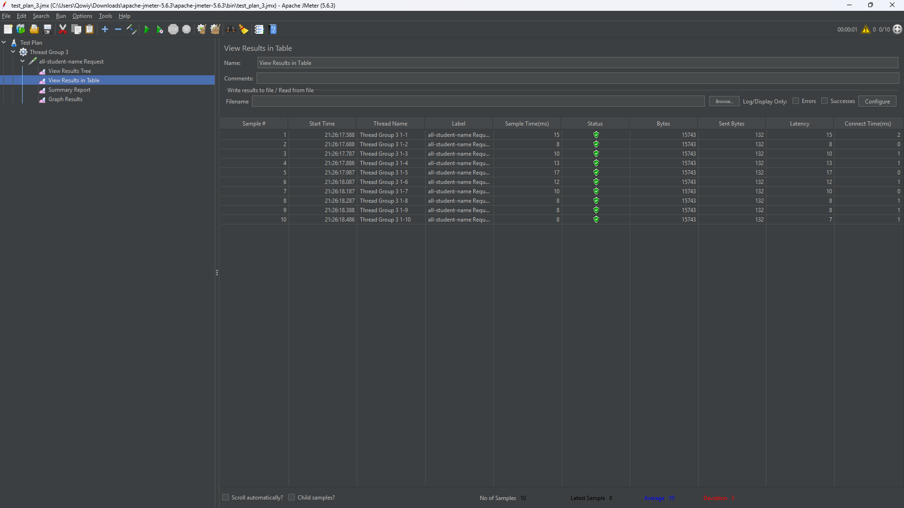
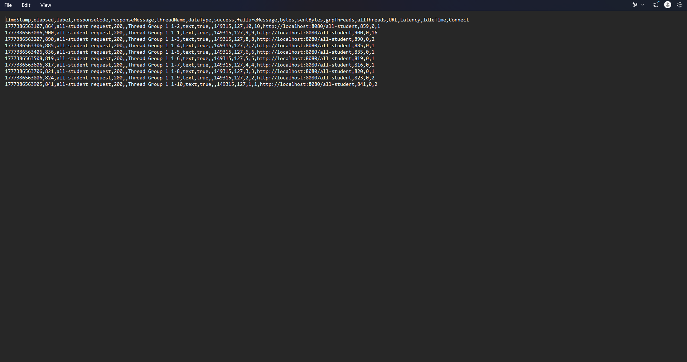
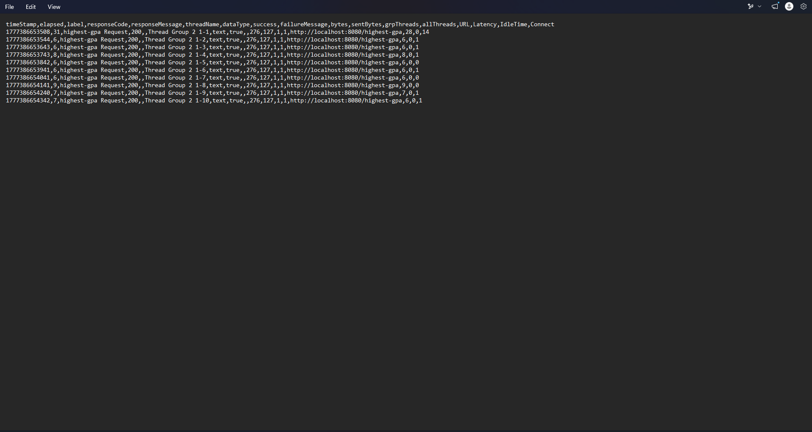
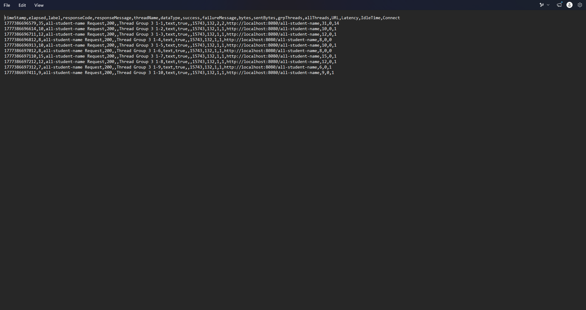

Reflection

1. Performance testing menggunakan JMeter berfokus pada pengujian dari sisi pengguna (black-box testing), yaitu mengukur response time, throughput, dan latency dari endpoint tanpa melihat implementasi kode di dalamnya. JMeter membantu mengetahui apakah sistem cepat atau lambat dalam kondisi tertentu (load testing).

Sedangkan IntelliJ Profiler berfokus pada analisis internal aplikasi (white-box profiling), yaitu melihat penggunaan CPU, memory, dan method mana yang paling berat di dalam kode. Profiler membantu mengetahui penyebab dari performa yang buruk.

Jadi, JMeter menjawab “apakah lambat?”, sedangkan Profiler menjawab “kenapa lambat?”.

2. Profiling membantu mengidentifikasi bagian kode yang paling banyak memakan resource, seperti:
- method yang menggunakan CPU tinggi
- query database yang terlalu sering (N+1 problem)
- alokasi objek yang berlebihan
- loop atau operasi yang tidak efisien

Dengan visualisasi seperti flame graph, kita dapat dengan mudah melihat bottleneck utama dalam aplikasi.

3. Menurut saya, IntelliJ Profiler sangat efektif dalam membantu analisis bottleneck karena:
- memberikan visualisasi yang jelas terhadap penggunaan CPU dan memory
- menunjukkan method yang paling berat secara langsung
- dapat melakukan comparison antara sebelum dan sesudah optimasi
- membantu menemukan masalah yang tidak terlihat dari log biasa

4. Beberapa tantangan yang dihadapi:
- hasil tidak selalu konsisten karena pengaruh JVM warm-up (JIT compiler)
- sulit membedakan noise dan bottleneck asli
- interpretasi flame graph yang cukup kompleks
- perbedaan hasil antara JMeter dan profiler

Cara mengatasinya:
- melakukan warm-up request sebelum pengukuran
- menjalankan test beberapa kali dan mengambil rata-rata
- menggunakan comparison view di IntelliJ Profiler
- memastikan environment testing stabil

5. Manfaat yang diperoleh:
- membantu menemukan bottleneck secara cepat
- memberikan insight detail sampai level method
- mempermudah optimasi query database (misalnya N+1 problem)
- membantu mengurangi penggunaan CPU dan memory
- mempercepat proses debugging performa

6. Jika terjadi ketidaksesuaian antara IntelliJ Profiler dan JMeter, maka langkah yang dilakukan adalah:
- memastikan kedua pengujian dilakukan pada kondisi yang sama
- mengecek apakah ada caching (Hibernate cache, DB cache)
- melakukan warm-up JVM sebelum profiling
- mengulang pengujian beberapa kali untuk validasi
- menggabungkan hasil kedua tools sebagai referensi (JMeter untuk real-world load, profiler untuk root cause)

7. Strategi optimasi yang digunakan:
- mengurangi query database yang tidak perlu (menghindari N+1 problem)
- menggunakan JPQL projection untuk mengambil data yang dibutuhkan saja
- memindahkan perhitungan ke database (ORDER BY, LIMIT)
- menghindari loop berat di Java

Untuk memastikan fungsi aplikasi tidak rusak:
- melakukan testing setiap endpoint setelah perubahan
- membandingkan hasil output sebelum dan sesudah optimasi
- menggunakan profiling untuk memastikan logic masih benar
- tidak mengubah business logic, hanya optimasi akses data